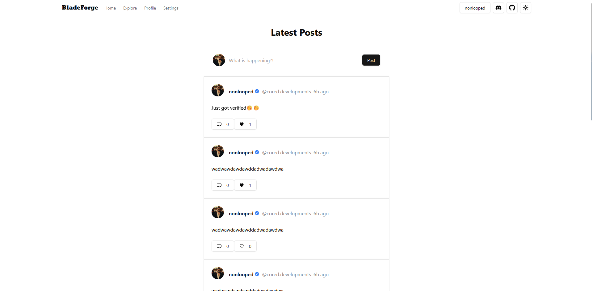
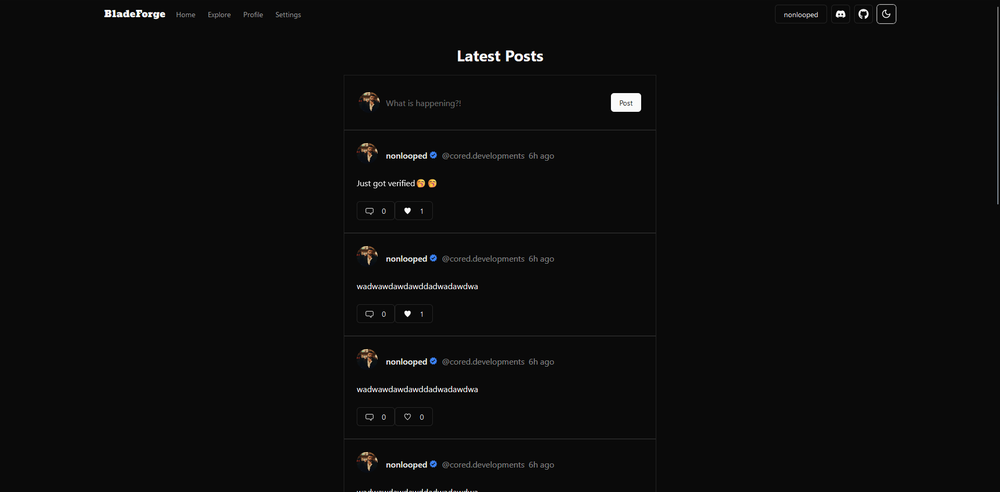

# Social

Welcome to the Social App! This is a beginner-friendly project that demonstrates how to implement CRUD operations using Next.js, NextAuth.js, Prisma, Tailwind CSS, and tRPC. The app is designed to follow best practices and uses PostgreSQL as the database.

## Table of Contents

- [Social](#social)
  - [Table of Contents](#table-of-contents)
  - [Features](#features)
  - [Preview](#preview)
  - [Getting Started](#getting-started)
  - [Alternatives to PostgreSQL](#alternatives-to-postgresql)
  - [Contributing](#contributing)
  - [Future Plans](#future-plans)
  - [Resources](#resources)
  - [Special Thanks](#special-thanks)

## Features

- User authentication and authorization using NextAuth.js
- CRUD operations for managing user profiles, posts, and comments
- Integration with Prisma for database management
- Responsive and modern UI design using Tailwind CSS and Shadcn UI
- API communication with tRPC

## Preview

## Getting Started

To get started with the Social App, follow these steps:

1. Clone the repository: `$ git clone https://github.com/unloopedmido/social-app.git`
2. Install dependencies: `$ npm install`
3. Set up the PostgreSQL database and update the connection details in the `.env` file.
4. Run database migrations: `$ npx prisma migrate dev`
5. Start the development server: `$ npm run dev`
6. Open your browser and navigate to `http://localhost:3000`

## Alternatives to PostgreSQL
If you do not want to use PostgreSQL for the database, you can switch to another provider in your `schema.prisma` and make sure to change the `DATABASE_URL` in your `.env` file accordingly.

Here are the supported database providers:
- PostgreSQL
- MySQL
- MongoDB
- CockroachDB
- MariaDB
- Microsoft SQL Server
- SQLite

More info about supported databases [here](https://www.prisma.io/docs/orm/reference/supported-databases)

## Contributing

Contributions to the Social App are welcome! If you find any issues or have suggestions for improvements, please open an issue or submit a pull request on the [GitHub repository](https://github.com/unloopedmido/social-app).

## Future Plans

In the future, we plan to implement a comments system to enhance the social interaction within the app. Stay tuned for updates!

## Resources

- [Next.js Documentation](https://nextjs.org/docs)
- [NextAuth.js Documentation](https://next-auth.js.org/getting-started/introduction)
- [Prisma Documentation](https://prisma.io/docs)
- [Tailwind CSS Documentation](https://tailwindcss.com/docs)
- [shadcn/ui Documentation](https://ui.shadcn.com/docs)
- [tRPC Documentation](https://trpc.io/docs)
- [Create T3 Documentation](https://create.t3.gg/en/introduction)

## Special Thanks
I'd like to give a special thanks to the creators of create-t3-app as this project was scaffolded using their generator which also follows the best typescript and nextjs practices